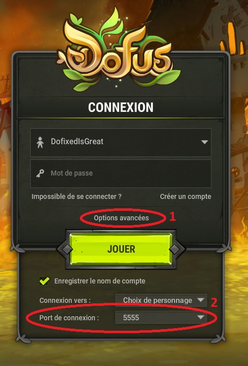
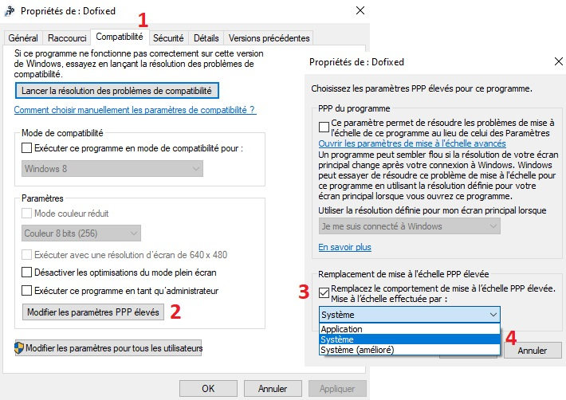
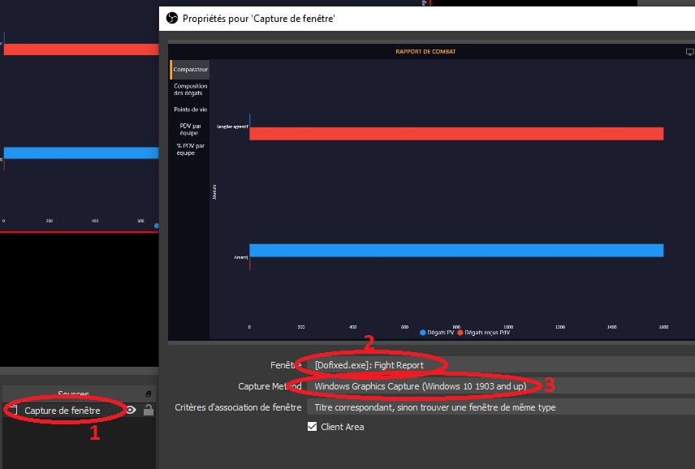

## FAQ

1. [How do I install Dofixed?](#Q1)
2. [How do I access the sightline tool I saw on Twitter?](#Q2)
3. [Is a Mac/Linux version planned?](#Q3)
4. [Why isn't Dofixed open-source?](#Q4)
5. [How do I check I am on port 5555?](#Q5)
6. [The semi-tactical mode is not at the good position!?](#Q6)
7. [Dofixed does not launch](#Q7)
8. [Why is Dofixed asking for an internet access through the firewall?](#Q8)
9. [Dofixed has crashed, how do I report a bug?](#Q9)
10. [Where can I suggest new functionalities?](#Q10)
11. [Is Dofixed authorized by Ankama?](#Q11)
12. [The HP heart is at the top left corner in fight!](#Q12)
13. [How can I record the fight report window?](#Q13)
14. [Items I drop are not added to my Kamas session](#Q14)
15. [What are .dfxr files? How do I open them?](#Q15)
16. [What do the different numbers in the Kamas part of the session mean?](#Q16)
17. [What do the colors of the Dofixed logo mean?](#Q17)

###  1. How do I install Dofixed?

Using [this link](https://github.com/dofixed/dofixed-install/archive/master.zip) you'll get an archive containing:
- a .gitignore file, that you can... ignore
- a version.xml file showing the version of Dofixed you've just downloaded
- a DofixedInstaller.exe file

Executing the DofixedInstaller file, the installation process should start, and you'll only have to follow the instructions to complete it :)

###  2. How do I access the sightline tool I saw on Twitter?

Ankama did not want this tool to be kept in Dofixed. The functionality is therefore disabled for the moment.

###  3. Is a Mac/Linux version planned?

We preferred a Windows-only version with useful features rather than a multi-platform software with less functionality. Moreover, the team does not have the hardware that would allow us to test the code quickly and in good conditions on Mac. This is therefore not being considered at the moment.

###  4. Why isn't Dofixed open-source?

There are three main reasons:
- some parts of the code could be used to facilitate the creation of software such as bots. We prefer not helping them :)
- we stay in touch with Ankama and don't add functionalities they don't agree with. We do not want people to be able to modify Dofixed to add such undesired features.
- we do not want to deal with bug reports from versions which would not be the version we distributed

###  5. How do I check I am on port 5555?

The choice is made from the Dofus login page by clicking on "Advanced options".

    
With pictures

    

###  6. The semi-tactical mode is not at the good position!?

If you have a high-resolution screen or a Windows zoom factor, it may be because of this. To change the Dofixed display without touching your Windows settings, right click on the Dofixed icon on your desktop, then "Properties", "Compatibility" tab, "Change High DPI Settings" button. In the new window, check the box "Replace high PPP scaling behaviour" and select the "System" option. Then exit the options by pressing "Ok" and then "Ok". This should solve the problem the next time Dofixed is restarted. If the problem is still present, you can also test the "System (Enhanced)" option.

    
With pictures

    

###  7. Dofixed does not launch

By default, Dofixed is only a small black square at the top left corner of your Dofus window. If the associated Dofus window is not the active window, Dofixed hides to avoid obstructing the view of other applications. If Dofixed still does not appear by clicking on the associated Dofus window, try reporting the bug on our discord server.

###  8. Why is Dofixed asking for an internet access through the firewall?

Just as Dofus can't work without internet, Dofixed needs a connection to work properly.

###  9. Dofixed has crashed, how do I report a bug?

You can report bug on our [Discord server](https://discord.gg/myM4GzjgPR). Don't forget to describe the situation as precisely as possible. "It doesn't work" will not help much solving the problem. "Dofixed crashes when I start it and I have three Dofus windows open" on the other hand will help us to find the problem quicker. If necessary, please attach the corresponding log file to your message. Dofixed creates one file per day (deleted every week) which is stored in its installation/Log directory. You can also open this folder directly from Dofixed tab "Autre".

###  10. Where can I suggest new functionalities?

Just jump in our [Discord serveer](https://discord.gg/myM4GzjgPR)!

###  11. Is Dofixed authorized by Ankama?

It's a difficult question... We stay in touch with Ankama so they can validate the ideas we want to implement in Dofixed. On the other hand, the use of third party programs is still forbidden by the TOS of Dofus. Ankama's official position is therefore that Dofixed is not authorized. The advertising of Dofixed in game on public channels and on the forum is therefore prohibited.

###  12. The HP heart is at the top left corner in fight!

It is a very small bug simple to solve: you just have to move the UI section with the heart and the spell bar anywhere. You can then put it back where it was, and the Dofixed heart should find its position by itself from now on.

###  13. How can I record the fight report window?

Very special nature of Dofixed windows (multi-window, transparency etc...) makes them a little more complicated to record with conventional software like OBS. This is mainly due to Windows rendering them with a method that does not allow OBS to capture them as easily as classic windows (for optimisation purposes).
There is however a way to record the fight report window. This solution requires at least Windows 10 and a version > 25 of OBS. To capture the fight report, you must use a "Window capture" scene, select the relevant window (nomally named \[Dofixed.exe\]: Fight Report), and use the "Windows Graphics Capture" tool. If all goes well, the window preview should appear and the window itself should be sourrounded by a yellow rectangle. This rectangle is added by Windows to indicate that the window is being captured, it does not appear in the record.

    
With pictures

    

###  14. Items I drop are not added to my Kamas session

For the session to count your dropped items, Dofixed needs to know your game server (to use estimated prices). You can check if Dofixed knows your server by the color of the logo. If it's white, everything is fine. If not, just use the /whoami command in Dofus chat and change from the current map (go to your heavenbag for example). If you've already used this command on this character once, changing map is enough!

###  15. What are .dfxr files? How do I open them?

.dfxr files are the files creating by Dofixed to record a fight, allowing people to replay it later. To read them, you must use the Dofixed Replayer. It is automatically installed along with Dofixed. If you do not want to install Dofixed, but do want to use the replayer to replay fights, a standalone version can be found following [this link](https://github.com/dofixed/dofixed-replayer/archive/master.zip). Contrary to Dofixed, the replayer does not require you to have Dofus or Dofixed installed on your computer, and does not need any internet connection.

###  16. What do the different numbers in the Kamas part of the session mean?

Session's Kamas are divided into three parts, in order:
- the raw Kamas obtained at the end of fights, quests or achievements. If the multi-account option of Dofixed is activated, the Kamas obtained through quests and achievements of all accounts are added
- the estimated Kamas from the resources obtained at the end of fights, quests or achievements. If the multi-account option is activated, the items of the quests and achievements of all accounts are added
- Kamas "destroyed" when using Zaap, opening a bank account, selling in HDV or bad quest dialogs. If the multi-account option is activated, the Kamas destroyed from all accounts are added

###  17. What do the colors of the Dofixed logo mean?

The logo can be colored with different teints indicating a potentiel problem with Dofixed. If you move your mouse over the logo, a tooltip should appear to tell you what the problem is, and a potential solution to fix it.
