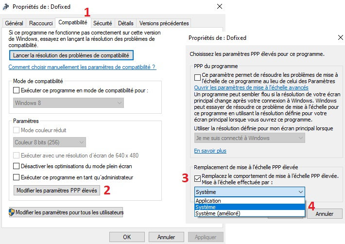
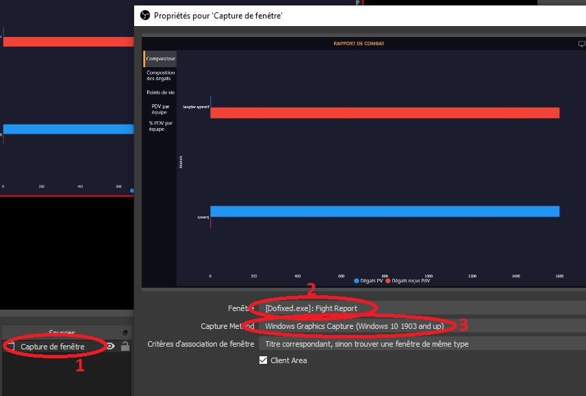

## FAQ

1. [Comment installer Dofixed ?](#Q1)
2. [Comment accéder à l'outil des lignes de vue présenté sur Twitter ?](#Q2)
3. [Une version Mac/Linux est-elle prévue ?](#Q3)
4. [Pourquoi ne pas rendre Dofixed open-source ?](#Q4)
5. [Comment vérifier que je suis bien sur le port 5555 ?](#Q5)
6. [Le mode semi-tactique est décalé !?](#Q6)
7. [Dofixed ne se lance pas](#Q7)
8. [Pourquoi Dofixed me demande un accès à internet pour le pare-feu ?](#Q8)
9. [Dofixed a cessé de fonctionner, comment remonter un bug ?](#Q9)
10. [Comment proposer une nouvelle fonctionnalité ?](#Q10)
11. [Est-ce que Dofixed est autorisé par Ankama ?](#Q11)
12. [Le coeur des PV est tout en haut à gauche en combat !](#Q12)
13. [Comment capturer la fenêtre du rapport de combat ?](#Q13)

###  1. Comment installer Dofixed ?

En utilisant [ce lien](https://github.com/dofixed/dofixed-install/archive/master.zip) vous obtiendrez une archive contenant : 
- un fichier .gitignore, que vous pouvez ... ignorer
- un fichier version.xml vous indiquant la version de Dofixed que vous avez téléchargée
- un fichier DofixedInstaller.exe

En exécutant le DofixedInstaller, le processus d'installation se lancera, vous n'aurez plus qu'à suivre les instructions :)

###  2. Comment accéder à l'outil des lignes de vue présenté sur Twitter ?

Ankama n'a pas souhaité que cet outil soit conservé dans Dofixed. La fonctionnalité est donc désactivée pour le moment.

###  3. Une version Mac/Linux est-elle prévue ?

Nous avons privilégié une version Windows uniquement avec des fonctionnalités utiles plutôt qu'un logiciel portable sur plusieurs plateformes mais avec moins de fonctionnalités. De plus, l'équipe ne dispose pas du matériel qui nous permettrait de tester le code rapidement et dans de bonnes conditions sur Mac. Ce n'est donc pas envisagé pour le moment. 

###  4. Pourquoi ne pas rendre Dofixed open-source ?

Il y a trois raisons principales :
- certaines parties du code pourraient être utilisées pour faciliter la création de logiciels tels que les bots. Nous préférons que leurs créateurs ne bénéficient pas de notre aide :)
- nous restons à l'écoute d'Ankama sur les fonctionnalités de l'application et nous ne souhaitons pas que des personnes puissent modifier Dofixed afin d'y ajouter des fonctionnalités non désirées par Ankama
- nous ne souhaitons pas avoir à traiter des éventuels retours de bugs provenant de versions qui ne seraient pas la version que nous avons distribuée de Dofixed

###  5. Comment vérifier que je suis bien sur le port 5555 ?

Le choix se fait depuis la page de connexion à Dofus en cliquant sur "Options avancées".

    
En images

    

###  6. Le mode semi-tactique est décalé !?

Si vous avez un écran haute résolution ou bien un facteur de zoom Windows, cela peut venir de là. Pour modifier l'affichage de Dofixed sans toucher à vos réglages Windows, faites un clic droit sur l'icône de Dofixed sur votre bureau, puis "Propriétés", onglet "Compatibilité", bouton "Modifier les paramètres PPP élevés". Dans la nouvelle fenêtre, cochez la case "Remplacer le comportement de mise à l'échelle PPP élevée" et selectionnez l'option "Système". Quittez ensuite les options en appuyant sur "Ok" puis "Ok". Cela devrait résoudre le problème au prochain redémarrage de Dofixed. Si le problème est toujours présent, vous pouvez également tester l'option "Système (amélioré)".

    
En images

    

###  7. Dofixed ne se lance pas

Par défaut, Dofixed n'est qu'un petit rectangle noir en haut à gauche de la fenêtre Dofus sélectionné. Si la fenêtre Dofus associée n'est pas la fenêtre active, Dofixed se cache pour éviter de gêner la vue d'autres applications. Vérifiez qu'en cliquant sur la fenêtre Dofus associée à Dofixed le petit rectangle n'apparait pas ! Si vous êtes sûr que Dofixed ne s'est pas lancé, vous pouvez signaler votre bug sur Discord.

###  8. Pourquoi Dofixed me demande un accès à internet pour le pare-feu ?

Tout comme Dofus ne peut fonctionner sans accès à internet, Dofixed a besoin d'une connexion pour fonctionner correctement.

###  9. Dofixed a cessé de fonctionner, comment remonter un bug ?

Vous pouvez signaler les bugs que vous rencontrez sur notre [serveur Discord](https://discord.gg/AznAbSV). N'oubliez pas de décrire le plus précisément possible la situation. "Barbare fonctionne pas" ne nous aidera pas à régler le problème. En revanche "Barbare n'est pas indiqué raté alors que XLII m'a mis pacifiste et que je n'ai pas fait de dégâts ni soigné" nous permettra de corriger le bug bien plus rapidement. Si nécessaire, veuillez à joindre à joindre à votre message le fichier de logs correspondant. Dofixed créé un fichier par jour (supprimé toutes les semaines) qu'il stocke dans son répertoire d'installation/Log. Vous pouvez également ouvrir ce dossier depuis Dofixed, onglet "Autre".

###  10. Comment proposer une nouvelle fonctionnalité ?

Pour ça, direction notre [serveur Discord](https://discord.gg/AznAbSV) !

###  11. Est-ce que Dofixed est autorisé par Ankama ?

La question est difficile... L'équipe de Dofixed est en contact avec Ankama pour qu'ils valident les différentes fonctionnalités que nous ajoutons. En revanche l'utilisation de programme tiers est toujours interdite par les CGU de Dofus. La position officielle d'Ankama est donc que Dofixed n'est pas autorisé. La publicité de Dofixed en jeu et sur le forum est par conséquent interdite.

###  12. Le coeur des PV est tout en haut à gauche en combat !

C'est un petit bug très simple à résoudre : il vous suffit de bouger l'interface Dofus avec le coeur et la barre des sorts (puis de la remettre à sa place si vous voulez). Le coeur devrait retrouver sa position tout seul et se positionner correctement pour les combats suivants.

###  13. Comment capturer la fenêtre du rapport de combat ?

La nature très spéciale des fenêtres de Dofixed (multifenêtre, transparence etc ...) les rendent un peu plus compliqué à capturer avec les logiciels utilisés classiquement (OBS). Ceci est dû principalement à Windows qui ne permet pas à OBS de les capturer comme des fenêtres classiques afin d'optimiser le rendu.
Il existe cependant un moyen de capturer la fenêtre de rapport de combat si vous le souhaitez. Cette solution nécessite au minimum Windows 10 et la version 25 d'OBS (disponible uniquement en pre-release au moment de l'écriture de ces lignes).
Pour capturer le rapport de combat, vous devez utiliser une scène de type "Capture de Fenêtre", sélectionner la fenêtre concernée (normalement nommée \[Dofixed.exe\]: Fight Report) et utiliser la méthode de capture "Windows Graphics Capture". Si tout se passe bien, la prévisualisation de la fenêtre devrait apparaitre et la fenêtre devrait être entourée d'un rectangle jaune. Ce rectangle est ajouté par Windows pour indiquer qu'une capture est en cours, il n'apparait pas dans la capture en elle-même.

    
En images

    

