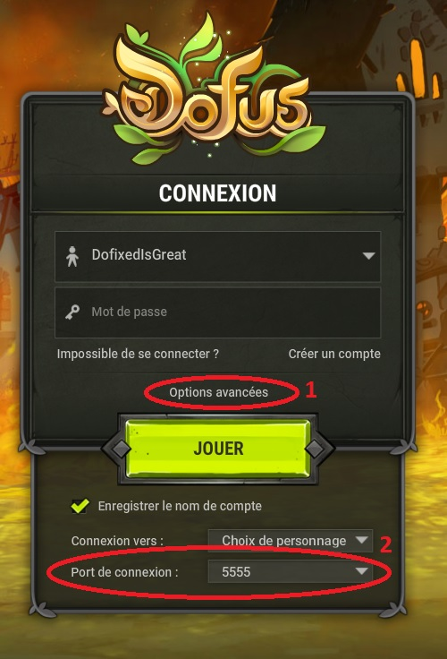

## FAQ

[Comment installer Dofixed ?](#Q1)
[Comment accéder à l'outil des lignes de vue présenté sur Twitter ?](#Q2)
[Une version Mac/Linux est-elle prévue ?](#Q3)
[Pourquoi ne pas rendre Dofixed open-source ?](#Q4)
[Comment vérifier que je suis bien sur le port 5555 ?](#Q5)

###  Comment installer Dofixed ?

En utilisant [ce lien](https://github.com/dofixed/dofixed-install/archive/master.zip) vous obtiendrez une archive contenant : 
- un fichier .gitignore, que vous pouvez ... ignorer
- un fichier version.xml vous indiquant la version de Dofixed que vous avez téléchargée
- un fichier DofixedInstaller.exe

En exécutant le DofixedInstaller, le processus d'installation se lancera, vous n'aurez plus qu'à suivre les instructions :)

###  Comment accéder à l'outil des lignes de vue présenté sur Twitter ?

Ankama n'a pas souhaité que cet outil soit conservé dans Dofixed. La fonctionnalité est donc désactivée pour le moment.

###  Une version Mac/Linux est-elle prévue ?

Nous avons privilégié une version Windows uniquement avec des fonctionnalités utiles plutôt qu'un logiciel portable sur plusieurs plateformes mais avec moins de fonctionnalités. De plus, l'équipe ne dispose pas du matériel qui nous permettrait de tester le code rapidement et dans de bonnes conditions sur Mac. Ce n'est donc pas envisagé pour le moment. 

###  Pourquoi ne pas rendre Dofixed open-source ?

Il y a trois raisons principales :
- certaines parties du code pourraient être utilisées pour faciliter la création de logiciels tels que les bots. Nous préférons que leurs créateurs ne bénéficient pas de notre aide :)
- nous restons à l'écoute d'Ankama sur les fonctionnalités de l'application et nous ne souhaitons pas que des personnes puissent modifier Dofixed afin d'y ajouter des fonctionnalités non désirées par Ankama
- nous ne souhaitons pas avoir à traiter des éventuels retours de bugs provenant de versions qui ne seraient pas la version que nous avons distribuée de Dofixed

###  Comment vérifier que je suis bien sur le port 5555 ?

Le choix se fait depuis la page de connexion à Dofus en cliquant sur "Options avancées".

    
En image

    </img>

